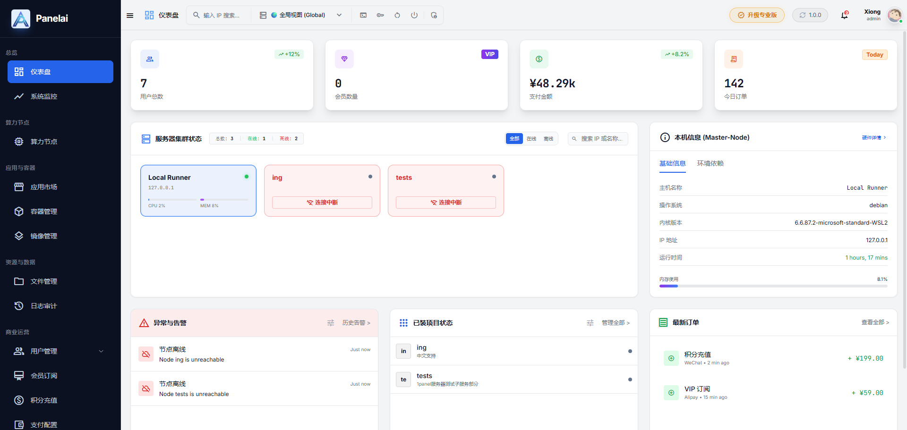
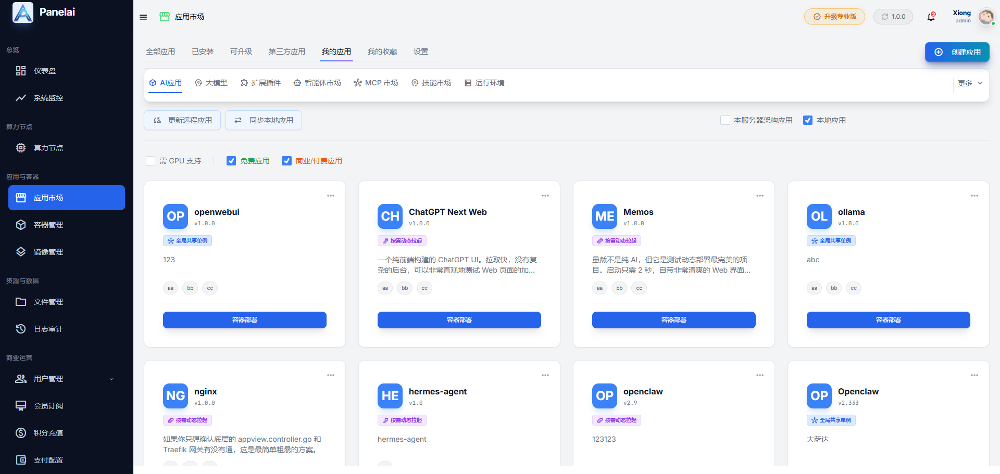
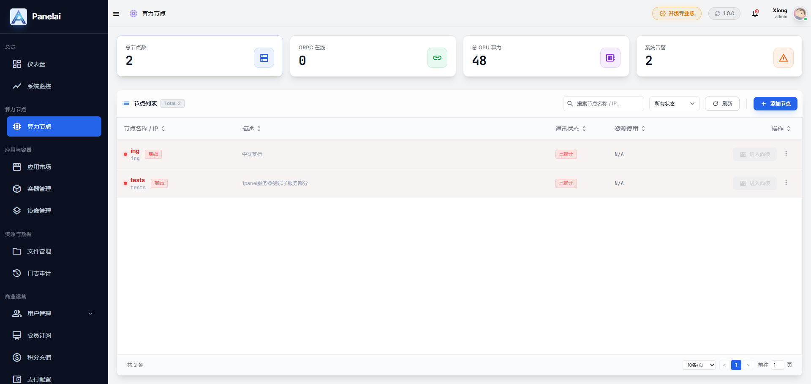
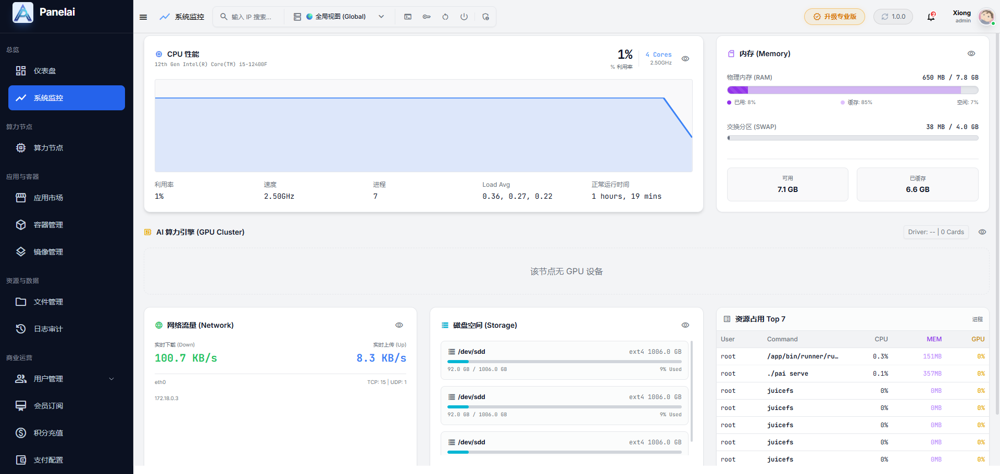

`<p align="center">
  
</p>

<h1 align="center">PanelAI</h1>

<p align="center">
  <strong>AI Native Infrastructure OS</strong>
</p>

<p align="center">
  从应用部署到集群管理，统一你的 AI 基础设施。
</p>

<p align="center">
  <strong>Deploy AI Like Installing Software.</strong>
</p>

<p align="center">
  <em>From Deployment to Infrastructure Management.</em>
</p>

<p align="center">
  
  
  
  
</p>

<p align="center">
  <a href="https://www.panelai.cn">官网</a> ·
  <a href="https://www.panelai.cn">下载测试版</a>
</p>

---

## 📸 Screenshots

### Dashboard | 整体控制台



### AI App Market | AI 应用市场



### Cluster Management | 节点集群管理



### System Monitoring | 系统监控



---

## 💡 What is PanelAI?

**PanelAI 不是 AI 应用，也不是传统服务器面板。**

它是专为 AI 时代打造的新一代 AI Native Infrastructure OS。

通过统一的平台管理 AI 应用、模型、节点与算力资源，让部署、运维和运营 AI 服务变得更加简单。

不同于传统服务器面板专注于网站、数据库和 Web 服务管理，PanelAI 专注于 AI 基础设施的统一管理，包括：

- AI 应用部署
- AI 模型统一接入
- 多节点管理与调度
- GPU 算力管理
- 私有化部署
- AI 应用市场
- AI 工作流生态
- 分布式集群管理
- 多租户与运营能力

---

## 🎯 Why PanelAI?

Web 时代有服务器面板。

AI 时代也需要属于自己的基础设施操作系统。

今天的 AI 应用、模型、节点和算力依然分散在不同工具之中。

开发者需要在模型平台、容器平台、运维平台和业务平台之间频繁切换。

PanelAI 希望用统一的平台连接这一切。

让部署、管理和运营 AI 像管理服务器一样简单。

---

## 🙋 Who is PanelAI for?

- ✅ AI 创业团队
- ✅ AI 应用开发者
- ✅ 私有化部署需求企业
- ✅ GPU 算力运营方
- ✅ MCP / Agent 开发者
- ✅ AI 服务提供商
- ✅ AI SaaS 创业团队
- ✅ 企业 AI 基础设施建设者

---

## 🚀 Why Choose PanelAI?

### 一键部署 AI 应用

无需复杂环境配置，快速完成 AI 应用部署。

### 多节点统一管理

统一管理分布式节点与服务器资源。

### 私有化数据控制

数据掌握在自己手中，支持企业级私有化部署。

### 模型统一接入

统一管理本地模型与第三方模型服务。

### GPU 算力管理

更高效地利用 GPU 与计算资源。

### Docker 原生架构

基于 Docker 构建，兼容主流云服务器与本地环境。

### 面向 AI 时代设计

不是传统服务器面板的功能堆叠，而是从 AI 基础设施视角重新设计。

---

## ✨ Features

| 核心能力 | 支持状态 |
| :--- | :---: |
| AI 应用一键部署 | ✅ |
| AI 模型统一接入 | ✅ |
| 多节点统一调度 | ✅ |
| 分布式集群管理 | ✅ |
| GPU 算力管理 | ✅ |
| 私有化部署 | ✅ |
| AI 应用市场 | ✅ |
| Docker 原生架构 | ✅ |
| API 统一路由 | ✅ |
| 日志与监控能力 | ✅ |
| 多租户与运营能力 | 🚧 |
| 企业级扩展能力 | 🚧 |
| RBAC 权限体系 | 🚧 |
| 插件生态系统 | 🚧 |

---

## 🚀 Quick Start (Beta)

### 系统要求

- Ubuntu 22.04+（推荐）
- 4 Core CPU
- 8 GB RAM
- 50 GB Disk
- 公网 IP（推荐）

### 一键安装

请根据您的服务器所在地域，选择对应的安装命令：

**🌏 国内服务器（极速源）**

```bash
curl -sSL https://install.panelai.cn/install.sh | bash
```

**🌍 海外服务器（GitHub 源）**

```bash
curl -sSL https://raw.githubusercontent.com/aihubpro/panelai/main/install_github.sh | bash
```

> **💡 子节点安装提示：**
> 在面板后台获取子节点的安装命令后，如果您的子节点位于海外服务器，只需将命令中的下载地址更换即可：把 `https://install.panelai.cn/install_node.sh` 替换为 `https://raw.githubusercontent.com/aihubpro/panelai-node/main/install_node_github.sh` ，后面的参数直接保留，无需任何修改。

安装完成后根据终端提示获取：

* 管理后台地址
* 默认管理员账号
* 默认管理员密码

### CLI 命令行工具

```bash
pai
```

常用功能：

* 查看运行状态
* 查看日志
* 重启服务
* 更新系统
* 修改管理员密码
* 导出诊断日志
* 管理节点连接
* 管理基础设施组件
---

## 🌐 Ecosystem

### AIStarter

AI Native Desktop Launcher

面向个人开发者的桌面 AI 应用中心。

👉 [https://www.starter.one](https://www.starter.one)

### Together
快速安装、运行和管理本地 AI 应用。

### Together

从本地开发、测试，到云端部署、运营与扩展。

PanelAI 与 AIStarter 共同构建完整的 AI Native 生态。

---

## 🗺️ Roadmap

### Beta

* [x] Go + Vue3 架构重构
* [x] AI 应用一键部署
* [x] AI 应用市场
* [x] 多节点基础管理
* [x] 分布式集群支持
* [x] 模型统一接入

### v1.0

* [ ] 多租户与运营能力 (用户/会员/充值/分润)
* [ ] 插件系统
* [ ] RBAC 权限体系
* [ ] 企业级组织管理
* [ ] GPU 调度增强
* [ ] 商业化订阅体系

### Long Term

* [ ] AI Agent Runtime
* [ ] MCP 原生生态
* [ ] AI 工作流生态
* [ ] 多区域集群调度
* [ ] AI Native OS 完整生态

---

## ⚖️ Open Source

PanelAI 当前处于 Beta 阶段。

我们正在持续探索开放生态、社区协作以及未来可能的开源模式。

具体策略将根据产品发展情况在后续版本中公布。

我们的目标始终是构建开放、可扩展的 AI Native 生态。

---

## ⭐ Support

如果 PanelAI 对你有帮助，欢迎 Star 本项目。

你的支持将帮助我们持续改进产品与生态。

---

## 🤝 Community

官网：

https://www.panelai.cn

问题反馈：

https://github.com/aihubpro/panelai/issues

欢迎提交 Issue、建议与反馈。

---

## 🌌 Vision

> 每一个行业，都值得用 AI 重构一遍。

我们相信，未来每一家企业都将拥有属于自己的 AI 基础设施。

PanelAI 希望成为 AI Native 世界的基础设施底座。

